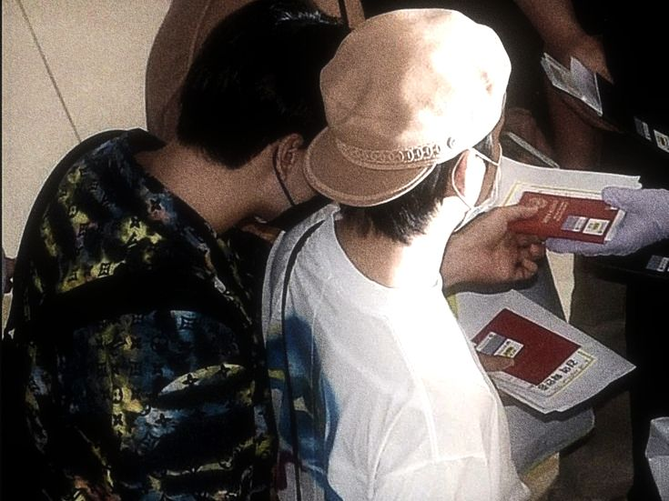

<!DOCTYPE html>
<html lang="en">
<head>
<meta charset="UTF-8">
<meta name="viewport" content="width=device-width, initial-scale=1.0">
<title>For Eil ♡</title>

</head>
<body>

<audio id="song" loop>
<source src="Strawberries & Cigarettes.mp3" type="audio/mpeg">
</audio>

<button class="music" onclick="toggleMusic()">
Strawberries & Cigarettes
</button>

<section class="hero">
<h1>For Eil ♡</h1>

A little collection of memories,
laughter and all the moments
that made our friendship special.

<button onclick="document.getElementById('letter').scrollIntoView({behavior:'smooth'})">
Open My Gift
</button>
</section>

<section id="letter">

<h2>Dear Eil,</h2>

 

Thank you for being part of my life.
This little website is filled with memories,
smiles and moments that I never want to forget.
I hope it reminds you how much you mean to me.

 

Love,
 
Rin ♡

</section>

<section>

<h2 style="margin-bottom:40px;">
when i think of you, i think of ...
</h2>

but you're

the life

i needed

all along

♡

</section>

<section>

<h2 style="margin-bottom:30px;">
Things I Love About You
</h2>

your personality

Always makes me smile

when you're yapping 

your kind heart and pure soul

Always makes me feel special

Simply being Eil

</section>

<section>

Thank you for every laugh,
every memory,
and every moment.

  

♡

</section>

</body>
</html>
